# 🗺️ VAYO COMMUNE — Interactive Product Roadmap

This document outlines the step-by-step engineering roadmap for Vayo Commune, structured across **8 key development phases**. It transitions Vayo from a high-fidelity landing and waitlist page into an interactive, AI-driven offline social network.

---

### 📊 Visual Roadmap Flowchart

The following flowchart shows the sequential progression of the phases and the exact modules required to build out each stage:

```mermaid
flowchart TB
    %% Definitions of Phases with their key items
    subgraph P1["Phase 1: Landing Website"]
        p1_1["Premium Hero Section"]
        p1_2["Smooth Scrolling Experience"]
        p1_3["Waitlist Form UI"]
        p1_4["Responsive Layout"]
        p1_5["Footer & Navigation"]
    end

    subgraph P2["Phase 2: Authentication"]
        p2_1["Login / Signup Pages"]
        p2_2["User Onboarding UI"]
        p2_3["Interest Selection Screens"]
        p2_4["Profile Setup Flow"]
    end

    subgraph P3["Phase 3: Karma System"]
        p3_1["Karma Points UI"]
        p3_2["Badge & Level System"]
        p3_3["Community Contribution Tracking"]
        p3_4["Leaderboard Interface"]
    end

    subgraph P4["Phase 4: Community Discovery"]
        p4_1["Community Cards"]
        p4_2["Search & Filters"]
        p4_3["Activity Recommendations"]
        p4_4["Discovery Sections"]
    end

    subgraph P5["Phase 5: Events & Real-World Meetups"]
        p5_1["Event Pages"]
        p5_2["RSVP Interface"]
        p5_3["Meetup Cards"]
        p5_4["Calendar/Event UI"]
    end

    subgraph P6["Phase 6: Social Layer"]
        p6_1["Feed UI"]
        p6_2["Messaging Interface"]
        p6_3["Notifications"]
        p6_4["Community Interaction Screens"]
    end

    subgraph P7["Phase 7: AI & Smart Matching"]
        p7_1["AI Recommendation Interface"]
        p7_2["Match Suggestion UI"]
        p7_3["Personalized Experience Design"]
    end

    subgraph P8["Phase 8: Premium Ecosystem"]
        p8_1["Premium Membership UI"]
        p8_2["Admin Dashboard"]
        p8_3["Analytics Panels"]
        p8_4["Performance Optimization"]
    end

    %% Phase Progression
    P1 --> P2
    P2 --> P3
    P3 --> P4
    P4 --> P5
    P5 --> P6
    P6 --> P7
    P7 --> P8

    %% Styling
    classDef phaseStyle fill:#111116,stroke:#3b82f6,stroke-width:1.5px,color:#fff;
    class P1,P2,P3,P4,P5,P6,P7,P8 phaseStyle;
```

---

## 🔍 Phase Details & Technical Specifications

Here is the itemized breakdown of the roadmap, showcasing how they map to existing code and future implementation designs.

### 🌐 Phase 1 — Landing Website (Completed / Foundation)

*Goal: Capture initial user interest and provide a premium presentation of Vayo Commune.*

* **Premium Hero Section:** Mesh gradient backgrounds, glowing titles, and custom logo shimmer transitions. See [src/app/page.js](file:///Users/chata/Desktop/Vayo_temp/src/app/page.js#L43-L85).
* **Smooth Scrolling Experience:** Built-in scroll indicators and targeted smooth scrolling to features.
* **Waitlist Form UI:** Geo-detection pre-selection, live phone verification, and custom loading indicators. See [src/app/join/page.js](file:///Users/chata/Desktop/Vayo_temp/src/app/join/page.js).
* **Responsive Layout:** Tailored styling configurations using Tailwind CSS v4 in [src/app/globals.css](file:///Users/chata/Desktop/Vayo_temp/src/app/globals.css).
* **Footer & Navigation:** Floating blur filters and quick contact linkages.

---

### 🔑 Phase 2 — Authentication

*Goal: Turn waitlisted users into verified members with personalized preference profiles.*

* **Login / Signup Pages:** Custom OAuth login interfaces (Google, Apple) and passwordless magic links.
* **User Onboarding UI:** Seamless interactive slides where users configure profile cards.
* **Interest Selection Screens:** visual tag selector where users pick categories (Outdoor, Cozy Dinners, Board Games, Sports).
* **Profile Setup Flow:** Setup avatars, connect social networks, write bios, and verify phone numbers.

---

### 🏆 Phase 3 — Karma System

*Goal: Incentivize community engagement and encourage high-quality, friendly behavior at events.*

* **Karma Points UI:** Dashboard displays tracking positive user interactions, host reviews, and community milestones.
* **Badge & Level System:** Badges ("Top Trekker", "Boardgame Guru", "Welcoming Host") that unlock special features as levels increase.
* **Community Contribution Tracking:** Analytics monitoring events hosted, sports pitches reserved, or boardgames shared.
* **Leaderboard Interface:** Monthly lists displaying top community stars to recognize verified hosts and helpful attendees.

---

### 🗺️ Phase 4 — Community Discovery

*Goal: Help members discover communities, local circles, and activity clusters they resonate with.*

* **Community Cards:** Interactive cards showcasing member counts, primary vibes, and hosts.
* **Search & Filters:** Search filters sorting by geographic radius, active times, and interest categories.
* **Activity Recommendations:** Personal suggestions matched against the user's onboarding tags.
* **Discovery Sections:** Curated groups (e.g., "Popular in Bangalore", "New Hikes This Week").

---

### 📅 Phase 5 — Events & Real-World Meetups

*Goal: Transition users offline by facilitating bookings, RSVPs, and calendars.*

* **Event Pages:** Detail maps, timing, coordinator host profiles, and attendee list previews.
* **RSVP Interface:** Ticketing checkouts, reservation limits, and automatic waitlist queueing.
* **Meetup Cards:** Elegant, scrollable highlights showcasing upcoming event cards. Inspired by [src/components/EventShowcase.jsx](file:///Users/chata/Desktop/Vayo_temp/src/components/EventShowcase.jsx).
* **Calendar/Event UI:** Personal calendars showing upcoming reserved meetups, with one-click export (Google, Apple Calendars).

---

### 💬 Phase 6 — Social Layer

*Goal: Support chat communication and community feeds for post-event connections.*

* **Feed UI:** Picture and text updates showing memories, reviews, and highlights from recent meetups.
* **Messaging Interface:** Cohort chat rooms activating 24h prior to an event, allowing coordination.
* **Notifications:** Push alerts for match alerts, chat rooms, and booking confirmations.
* **Community Interaction Screens:** Photo sharing threads, poll questions, and host thank-you cards.

---

### 🧠 Phase 7 — AI & Smart Matching

*Goal: Leverage smart suggestion engines to optimize match groups and recommend the best experiences.*

* **AI Recommendation Interface:** Panels explaining recommendations (e.g., "Recommended because you enjoy cozy games").
* **Match Suggestion UI:** Matching interfaces proposing small, chemistry-optimized cohorts (4–6 people).
* **Personalized Experience Design:** Adapts dashboard categories in real-time based on the user's history and ratings.

---

* [ ] 💎 Phase 8 — Premium Ecosystem

*Goal: Establish monetization models and admin tools to scale operations.*

* **Premium Membership UI:** Portal for premium subscriptions, early access RSVPs, and profile customization elements.
* **Admin Dashboard:** Oversight panel for host vetting, community reports, and waitlist approval.
* **Analytics Panels:** Event metrics, reservation show-up rates, active churn, and system speed.
* **Performance Optimization:** Edge routing, image optimization, dynamic page pre-rendering, and global caching.
